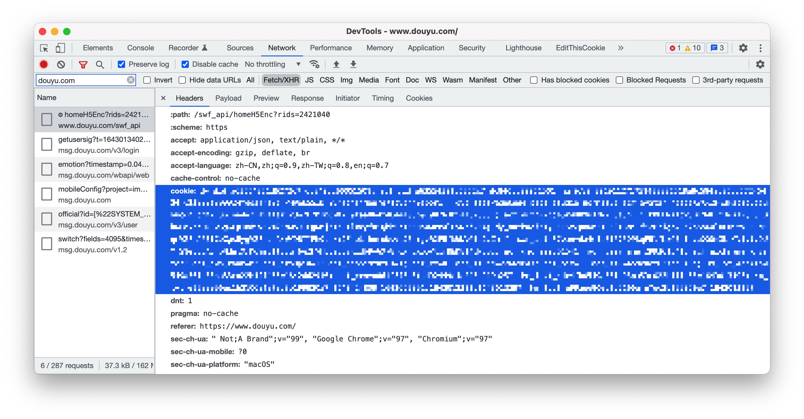

# Douyu Live Helper

斗鱼直播相关自动化脚本

## 功能

- [x] 每日获取并赠送荧光棒

## 获取 Cookies

程序会依序尝试从以下途径获取Cookies
  * `.env`中的`COOKIES`
  * 环境变量`COOKIES`
  * 已配置的[CookieCloud](https://github.com/easychen/CookieCloud)服务
  * `.cookies`文件内容

### 获取现有的 Cookies

打开无痕模式，随便打开一个直播间，然后打开开发人员工具，在网络/Network选项卡内过滤`douyu.com`的`Fetch/XHR`请求，随意挑选一个请求，然后在请求头中找到Cookie，复制冒号后面的内容（即下图浅蓝色部分）。



### 配置 CookieCloud

配置环境变量`COOKIE_CLOUD_URL`、`COOKIE_CLOUD_UUID`和`COOKIE_CLOUD_KEY`，在同步域名关键词中加入`douyu.com`。

## 配置与运行

### Docker Compose

1. 编写配置文件

根据需要修改environment条目的变量，并保存为`compose.yml`文件。

```yml
version: "3"

services:
  firefox:
    image: "selenium/standalone-firefox:latest"
    # image: "seleniarm/standalone-firefox:latest" # 在ARM机器上运行时使用
    network_mode: bridge
    shm_size: 2g
    environment:
      SE_OFFLINE: false
      START_XVFB: false
    healthcheck:
      test: ["CMD", "curl", "-f", "http://localhost:4444"]
  app:
    image: "rhyster/douyu-live-helper:latest"
    network_mode: bridge
    links:
      - firefox
    environment:
      MANUAL: 1 # 自定义赠送数量
      ROOM_ID: 48699 # 送礼目标直播间（以英文逗号间隔）
      SEND_COUNT: 1 # 对应荧光棒数量
      PUSHKEY: PUSHKEY_HERE # PushDeer PushKey
      CRON_EXP: 30 5 0 * * * # CRON 表达式
      SELENIUM_URL: http://firefox:4444/
      COOKIES: "${COOKIES}"
    depends_on:
      firefox:
        condition: service_healthy
```

2. 运行

```bash
COOKIES=$(cat .cookies) docker compose up --exit-code-from app --force-recreate
```

### Node

1. 运行环境

需要环境 Node.js >= 20.10.0，Google Chrome >= 97.0与对应的Chromedriver。

2. 配置

```bash
cp .env.example .env
vi .env
```

根据注释修改，如果需要禁用某项功能，将等号后置空或者改为0。

3. 开始运行

```bash
pnpm install
pnpm build
pnpm start
```

## 许可

MIT License
